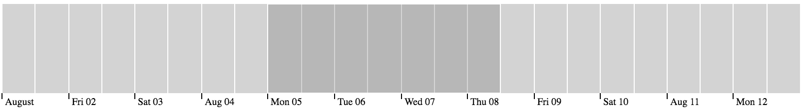
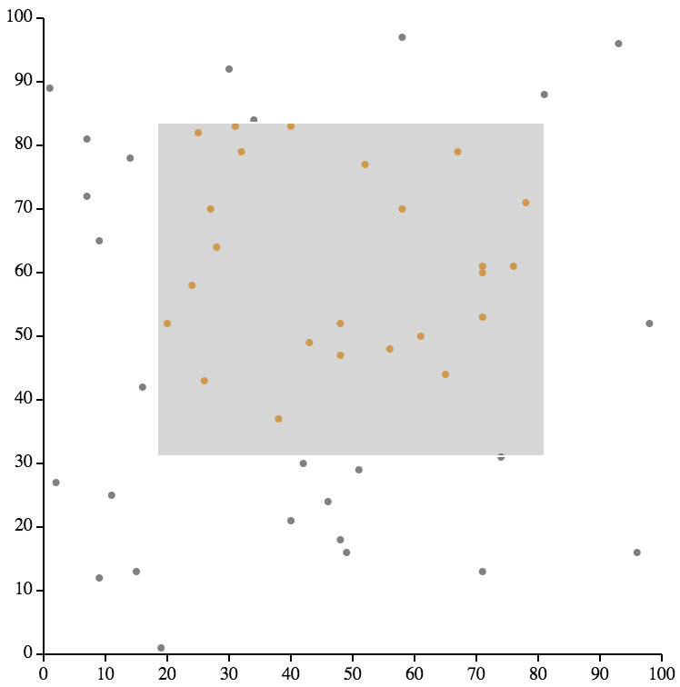

# React SVG Brush (Beta)

The [react-svg-brush](https://www.npmjs.com/package/react-svg-brush) is a React-based brush library that emulates the [d3-brush](https://github.com/d3/d3-brush) behavior. It renders the brush using React virtual DOM.

This library is still in Beta, please file bug reports by creating issues in the library [github repo](https://github.com/kenns29/react-svg-brush).

## Examples

**1D Brush**

[</img>](https://codepen.io/kennsmacintosh/pen/yLBPGbN)

**2D Brush**

[</img>](https://codepen.io/kennsmacintosh/pen/dybZwQj)

**Brush Snapping (Transition)**

[</img>](https://codepen.io/kennsmacintosh/pen/oNvoVaY)

## Why Yet Another Brush Library

The [d3-brush](https://github.com/d3/d3-brush) library is commonly used for data selection within visualizations. It enables data selection through dragging on the visualization interface (holding the left mouse and move the curser). It also renders the brushed area directly on the visualization. However, there are several drawbacks when using [d3-brush](https://github.com/d3/d3-brush) directly inside a React-based application:

- d3-brush directly modifies the DOM, which also means customization of the brush behavior/view has to be done directly on the DOM, violating the best practices in React.
- Using d3-brush inside a React component typically requires using the react lifecycle methods, e.g. `componentDidUpdate`, adding complexity in the implementation of the React component.

The React SVG Brush library emulates the d3-brush library DOM structure (95% identical) and functionalities but renders the Brush completely using the React virtual DOM, making it easy for applications that use d3-brush to switch to this library to adhere to the React best practices.

## Installation

```
npm install react-svg-brush
```

## Example Usage

```javascript
import React, {Component} from 'react';
import SVGBrush from 'react-svg-brush';

...

export default class App extends Component {
  onBrushStart = ({target, type, selection, sourceEvent})=>{...}
  onBrush = ({target, type, selection, sourceEvent})=>{...}
  onBrushEnd = ({target, type, selection, sourceEvent})=>{...}
  renderBrush = () => (
    <SVGBrush
      // Defines the boundary of the brush.
      // Strictly uses the format [[x0, y0], [x1, y1]] for both 1d and 2d brush.
      // Note: d3 allows the format [x, y] for 1d brush.
      extent={[[x0, y0], [x1, y1]]}
      // Obtain mouse positions relative to the current svg during mouse events.
      // By default, getEventMouse returns [event.clientX, event.clientY]
      getEventMouse={event => {
        const {clientX, clientY} = event;
        const {left, top} = this.svg.getBoundingClientRect();
        return [clientX - left, clientY - top];
      }}
      brushType="2d" // "x"
      onBrushStart={this.onBrushStart}
      onBrush={this.onBrush}
      onBrushEnd={this.onBrushEnd}
    />
  )
  render() {
    return (
      <svg ref={input => (this.svg = input)}>
        {this.renderBrush()}
      </svg>
    );
  }
}
```

The following shows the DOM structure generated by React SVG Brush:

```html
<g class="brush">
  <rect class="overlay" pointer-events="all" cursor="crosshair" fill="none" x="40" y="10" width="380" height="350"></rect>
  <rect class="selection" cursor="move" fill="#777" fill-opacity="0.3" stroke="#fff" shape-rendering="crispEdges" x="217.80859375" y="144.046875" width="30.26171875" height="185.546875"></rect>
  <rect class="handle handle--n" cursor="ns-resize" x="212.80859375" y="139.046875" width="40.26171875" height="10" fill="none" pointer-events="visible"></rect>
  <rect class="handle handle--e" cursor="ew-resize" x="243.0703125" y="139.046875" width="10" height="195.546875" fill="none" pointer-events="visible"></rect>
  <rect class="handle handle--s" cursor="ns-resize" x="212.80859375" y="324.59375" width="40.26171875" height="10" fill="none" pointer-events="visible"></rect>
  <rect class="handle handle--w" cursor="ew-resize" x="212.80859375" y="139.046875" width="10" height="195.546875" fill="none" pointer-events="visible"></rect>
  <rect class="handle handle--nw" cursor="nwse-resize" x="212.80859375" y="139.046875" width="10" height="10" fill="none" pointer-events="visible"></rect>
  <rect class="handle handle--ne" cursor="nesw-resize" x="243.0703125" y="139.046875" width="10" height="10" fill="none" pointer-events="visible"></rect>
  <rect class="handle handle--se" cursor="nwse-resize" x="243.0703125" y="324.59375" width="10" height="10" fill="none" pointer-events="visible"></rect>
  <rect class="handle handle--sw" cursor="nesw-resize" x="212.80859375" y="324.59375" width="10" height="10" fill="none" pointer-events="visible"></rect>
</g>
```

More demo code can be found in this repo, [React SVG Brush Example](https://github.com/kenns29/react-svg-brush-example).

## API Reference

### Attributes

`brushType` **(String, Required)**

- Default: `'2d'`

Choose the brush type. Three brush types are supported: `2d`, `x`, and `y` (`y` is still experimental). The `2d` allows dragging on all sides and corners, whereas the `x` and `y` brush only allows dragging on horizontal and vertical directions respectively.

`extent` **(Array, Required)**

- Default: `[[0, 0], [1, 1]]`

Defines the brush boundary. The array `[[x0, y0], [x1, y1]]` defines the bounding box of the brush boundary, where `[x0, y0]` represents the point in top-left corner and `[x1, y1]` represents the point in the bottom-right corner.

`selection` **(Array, Optional)**

- Default: `undefined`

Manually set the selection of the brush. This is typically used when setting the initial state of the brush, or when post processing the brush selections, e.g. brush snapping. Like the `extent`, the `selection` is also defined by a bounding box array `[[x0, y0], [x1, y1]]`. When the `selection` parameter is defined, the brush will be rendered according to the selection. When the `selection` parameter is set to `null`, the brush will be cleared. When the `selection` parameter is `undefined`, the brush  rendering will be automatically controlled during the interactions.  

### Methods

`getEventMouse` **(Function, Optional)**

- Default: `event => [event.clientX, event.clientY]`

Obtain the mouse position given the pointer event. It must return an array of `[x, y]` that specifies the position of the mouse. By default, it returns `[event.clientX, event.clientY]` which is the position relative to the web page. The default behavior of this function is typically overwritten, because it is more common to use the position relative to the container of the brush (e.g. the SVG).

`onBrushStart` **(Function, Optional)**

The callback function when the brushing interaction starts (i.e. mouse click). This function receives one object as the argument, which contains the following attributes:

- `target` - Refers to the brush object itself (the React component).
- `type` - The type of the callback, in this case, it is `start`
- `selection` - The brush selection when the brush starts.
- `sourceEvent` - The React `SyntheticEvent` of the brush, in this case, it is a pointer event.

`onBrush` **(Function, Optional)**

The callback function during brush interaction (i.e. while dragging the brush). This function receives one object as the argument, which contains the following attributes:

- `target` - Refers to the brush object itself (the React component).
- `type` - The type of the callback, in this case, it is `brush`
- `selection` - The changed brush selection during the interaction.
- `sourceEvent` - The React `SyntheticEvent` of the brush, in this case, it is a pointer event.

`onBrushEnd` **(Function, Optional)**

The callback function at the end of brush interaction (i.e. mouse up). This function receives one object as the argument, which contains the following attributes:

- `target` - Refers to the brush object itself (the React component).
- `type` - The type of the callback, in this case, it is `end`
- `selection` - The changed brush selection at the end of the brush interaction.
- `sourceEvent` - The React `SyntheticEvent` of the brush, in this case, it is a pointer event.

## Change Log

Refer to the [CHANGELOG.md](CHANGELOG.md) file.